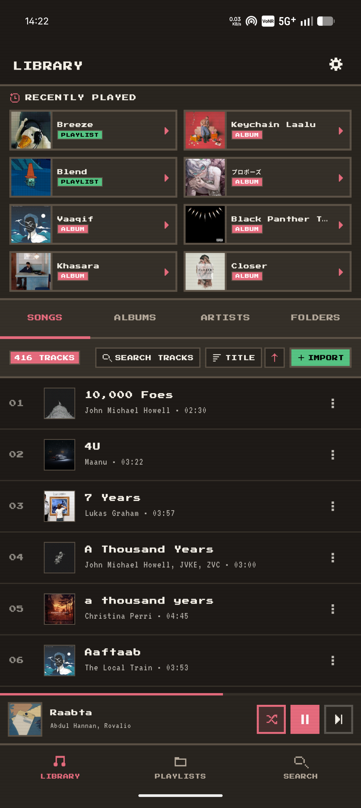
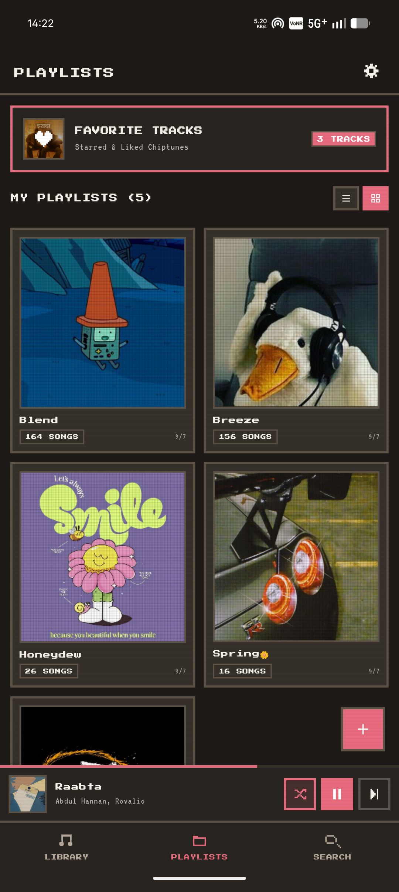
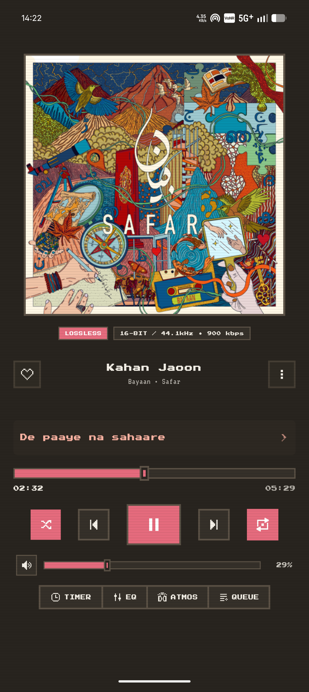
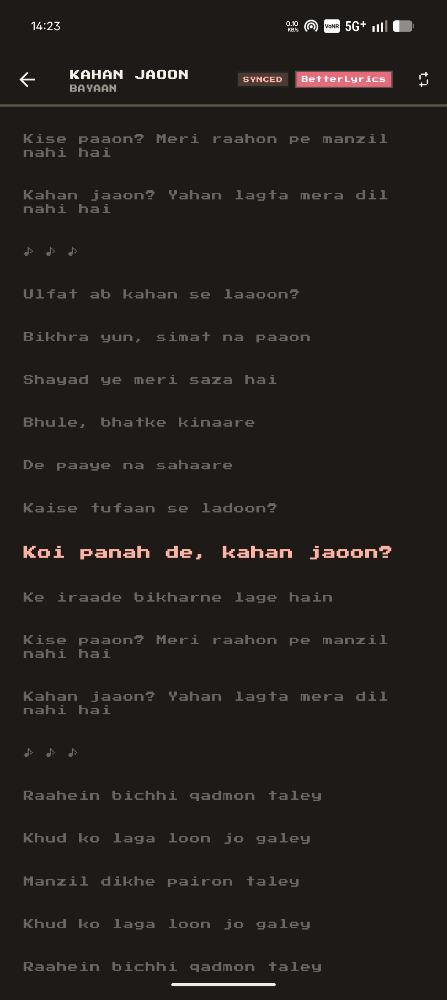
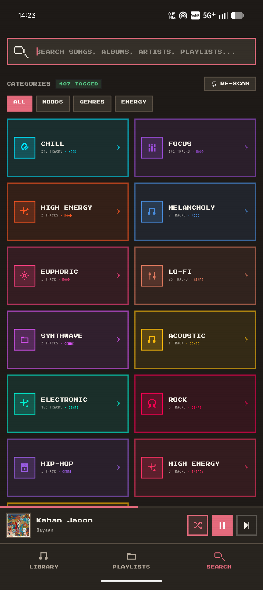
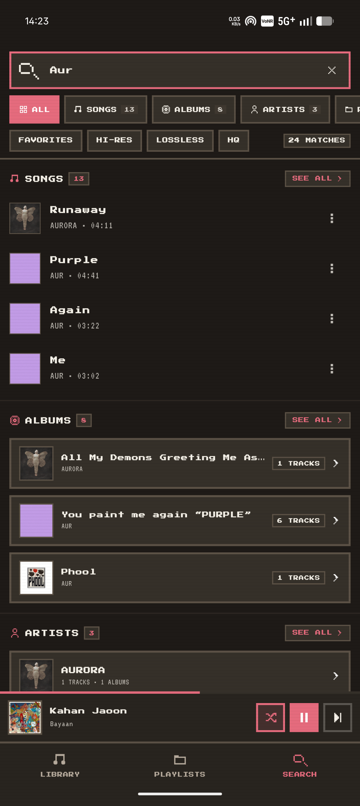

<div align="center">


# 🎵 myMusic

**Audiophile-grade offline music player with a Retro 8-Bit aesthetic**

[](https://flutter.dev)
[](https://dart.dev)
[](https://github.com/Asrar-Ahammad/my_music/releases)
[](https://flutter.dev/multi-platform)

*Bit-perfect playback · 100% offline · Retro Industrial Arcade UI · 120Hz smooth*

</div>

---

## 📖 Overview

**myMusic** is a privacy-first, offline-first local music player built with Flutter. Designed for audiophiles with large FLAC and hi-res libraries, it delivers bit-perfect sound reproduction paired with an iconic **Retro 8-Bit / Industrial Arcade** aesthetic — inspired by vintage hi-fi gear, CRT terminals, and classic gaming consoles.

No telemetry. No cloud sync. No ads. Just your music, beautifully.

---

## ✨ Features

### 🎨 Retro Design System
- **Chunky 2.5px Solid Borders** on every card, button, and panel — pure angular pixel art geometry
- **Zero Border Radius** — no rounded corners, no blur shaders, no drop shadows
- **5 Color Themes** — Dark Arcade, Light Classic, OLED Black, Retro Amber, Cyberpunk Neon
- **Monet Dynamic Engine** — real-time palette generation extracted from active album artwork
- **Retro Typography** — PressStart2P (8-bit headers), VT323 (CRT readouts), Geist / GeistMono (body), Satoshi (secondary), Gotham

### 🔊 Hi-Res Audio Engine
- **Bit-perfect decoding** via `just_audio` — FLAC, ALAC, WAV, AAC, MP3
- **Background playback** with system notification controls (artwork, seekbar, transport)
- **Audio session management** — duck on calls, auto-pause on headset disconnect, handle noisy intents
- **Custom shuffle dot** in system notification for instant visual confirmation of shuffle state
- **Loop mode cycling** — Loop Off → Loop All → Loop One, directly from the notification

### 🎛️ 10-Band Equalizer & DSP
- 10-band graphic equalizer with preamp gain control
- Presets: *Flat, Bass Boost, Treble Boost, Rock, Pop, Jazz, Electronic, Vocal, Classical*
- **Spatial Audio** — crossfeed and binaural room simulation for headphone listening
- Persistent preset saving across app restarts

### 📋 Spotify-Style Queue Management
- **Swipe Right → Add to Queue** — stacks a priority queue on top of the active playlist; drains it first, then resumes the original queue seamlessly
- **Swipe Left → Play Next** — inserts directly after the currently playing track
- **Reorderable queue sheet** with drag-and-drop handles and swipe-to-remove

### 📚 Library & Navigation

| Tab | Description |
|-----|-------------|
| **All Songs** | Alphabetical, date added, duration sort with fast scrollbar thumb |
| **Albums** | Grid & list views with multi-disc support and year grouping |
| **Artists** | Artist catalogue with full discography breakdown |
| **Folders** | Direct filesystem hierarchy browser |
| **Playlists** | User-created playlists with dynamic 4-art collage covers |
| **Recently Played** | Auto-tracked listening history with timestamps |

### 🎤 Real-Time Synchronized Lyrics
- Reads **embedded USLT / SYLT tags** and local `.lrc` files in the same directory as the audio
- **Word & syllable-level karaoke** sweeping with `SmoothLyricsTicker` and `LyricsSweeper`
- O(log N) binary search timestamp lookup — zero performance cost during playback ticks
- Tap any lyric line to jump playback to that moment; auto-scrolls active line with spring physics

### 🤖 On-Device AI Smart Tagging
- 100% offline background isolate DSP — no network calls, no audio stutter
- Windowed **RMS energy** + **zero-crossing rate** analysis
- Auto-classifies **Mood**: *Chill, Melancholy, Focus, High Energy, Euphoric*
- Auto-classifies **Genre**: *Lo-Fi, Acoustic, Classical, Electronic, Synthwave, Hip-Hop, Rock*
- Estimated **BPM** tagging per track

### ⚡ 120Hz Performance Engine
- `ScrollDecelerationRate.normal` — organic exponential momentum deceleration, no abrupt halts
- `ValueNotifier`-driven scroll state — zero `setState()` calls during active flings
- Fixed `itemExtent: 72.0` on song lists — no dynamic layout measurement at high velocity
- `RepaintBoundary` on every `RetroSongTile` — playback animations never repaint the full viewport
- Album art decoded at `memCacheWidth/Height: 120` — 3000×3000 FLAC covers never load into tile buffers

### 📁 Media Scanner
- Scans internal & external storage using `audio_metadata_reader`
- Extracts **ID3v2, Vorbis Comments, FLAC tags** — title, artist, album, genre, track #, year, sample rate, bit depth, bitrate
- Auto-extracts and disk-caches embedded album cover art
- **Folder blacklisting** — skip ringtones, voice memos, and game audio automatically

---

## 📸 Screenshots

<div align="center">

| Library | Playlists | Now Playing |
|:-------:|:---------:|:-----------:|
|  |  |  |

| Lyrics | AI Smart Search | Search Results |
|:------:|:---------------:|:--------------:|
|  |  |  |

</div>

---

## 🏗️ Architecture

Built with **Flutter + Riverpod** following strict unidirectional data flow:

```
myMusic/
├── lib/
│   ├── core/
│   │   ├── constants/          # App constants, Hive keys, AI model config
│   │   └── theme/              # Retro colors, typography, Monet engine
│   ├── data/
│   │   ├── repositories/       # Audio, playlist, settings repositories
│   │   └── services/           # Audio handler, scanner, lyrics, EQ, AI tagger
│   ├── domain/
│   │   └── models/             # Song, Album, Artist, Playlist, LRC, AI tags
│   └── presentation/
│       ├── providers/          # Riverpod providers (player, queue, library)
│       ├── widgets/            # RetroCard, RetroButton, RetroSlider, etc.
│       └── screens/            # Home, Library, Now Playing, Lyrics, EQ, Settings
└── test/                       # Unit, widget & integration tests
```

### Key Services

| Service | Responsibility |
|---------|---------------|
| `AudioPlayerHandler` | Background audio service, queue management, transport controls |
| `FileScannerService` | Local media discovery & metadata extraction |
| `LyricsService` | LRC parser, timestamp sync, binary search engine |
| `EqualizerService` | 10-band DSP processing & preset persistence |
| `LibraryTaggerService` | Background isolate DSP auto-classification (mood, genre, BPM) |
| `SpatialAudioService` | Binaural crossfeed and room simulation |
| `MonetEngine` | Real-time dynamic palette extraction from album artwork |
| `StorageService` | Hive database interface for all persistence |

---

## 🚀 Getting Started

### Prerequisites
- Flutter SDK `^3.12.x`
- Dart SDK `^3.12.2`
- Android SDK 21+ / iOS 14+

### Installation

```bash
# Clone the repository
git clone git@github.com:Asrar-Ahammad/my_music.git
cd my_music

# Install dependencies
flutter pub get

# Run on a connected device or emulator
flutter run --release
```

### Build

```bash
# Android APK
flutter build apk --release

# Android App Bundle (for Play Store)
flutter build appbundle --release

# iOS (requires macOS + Xcode)
flutter build ios --release
```

---

## 🧪 Testing

```bash
# Run all tests
flutter test

# Run with coverage report
flutter test --coverage

# Static analysis (0 errors, 0 warnings guaranteed)
flutter analyze
```

### Test Coverage

| Test File | What It Covers |
|-----------|----------------|
| `audio_player_handler_test.dart` | Priority queue stacking, play-next, loop/shuffle cycles, state restore |
| `lrc_lyrics_test.dart` | LRC parsing, binary search seek, syllable timing, empty line handling |
| `widget_retro_test.dart` | All Retro widgets — buttons, sliders, cards, badges, layout |
| `playlist_cover_test.dart` | Dynamic 4-art collage rendering & fallback covers |
| `ai_features_and_navigation_test.dart` | AI config, model manager file sizing, lyrics lead timing |
| `song_cache_performance_test.dart` | Cache hit rates and memory efficiency |
| `morphing_album_art_test.dart` | Album art transitions and animation states |
| `playback_state_persistence_test.dart` | Queue & playback position restoration across restarts |

---

## 📦 Key Dependencies

| Package | Version | Purpose |
|---------|---------|---------|
| `just_audio` | `^0.10.6` | Hi-res audio decoding & playback |
| `audio_service` | `^0.18.19` | Background playback & system notification |
| `audio_session` | `^0.2.4` | Audio focus, ducking & headset management |
| `flutter_riverpod` | `^3.4.3` | Reactive state management |
| `hive` + `hive_flutter` | `^2.2.3` | Local persistent storage |
| `audio_metadata_reader` | `^1.7.1` | ID3 / FLAC / Vorbis tag extraction |
| `material_color_utilities` | `^0.13.0` | Monet dynamic color engine |
| `file_picker` | `^12.2.0` | Manual folder selection |
| `permission_handler` | `^13.0.2` | Storage access permissions |
| `dio` | `^5.11.1` | HTTP client for AI model downloads |
| `flutter_svg` | `^2.3.0` | Custom vector icon rendering |

---

## 🎨 Themes

| Theme | Background | Accent | Vibe |
|-------|-----------|--------|------|
| **Dark Arcade** | `#121212` | Arcade Green | Classic retro gaming terminal |
| **Light Classic** | `#F5F1E8` | Pitch Black | Vintage hi-fi equipment manual |
| **OLED Black** | `#000000` | White | AMOLED power-saving dark mode |
| **Retro Amber** | `#1A1200` | `#FFB000` | Warm CRT phosphor glow |
| **Cyberpunk Neon** | `#0D0D1A` | `#8B5CF6` / `#06B6D4` | Electric neon terminal |

<!-- ---

## 🗺️ Roadmap

- [x] Screenshot showcase in README
- [ ] Android Auto support
- [ ] CarPlay integration
- [ ] Sleep timer with fade-out
- [ ] Last.fm scrobbling (opt-in)
- [ ] Home screen mini-player widget -->

---

## 🤝 Contributing

Contributions are welcome! Please open an issue first to discuss what you'd like to change.

1. Fork the repository
2. Create a feature branch (`git checkout -b feature/amazing-feature`)
3. Commit your changes (`git commit -m 'Add amazing feature'`)
4. Push to the branch (`git push origin feature/amazing-feature`)
5. Open a Pull Request

---

## 📄 License

This project is licensed under the MIT License — see the [LICENSE](LICENSE) file for details.

---

<div align="center">

Built with ❤️ by [Asrar Ahammad](https://github.com/Asrar-Ahammad)

*"Your music. Your device. Your control."*

</div>
